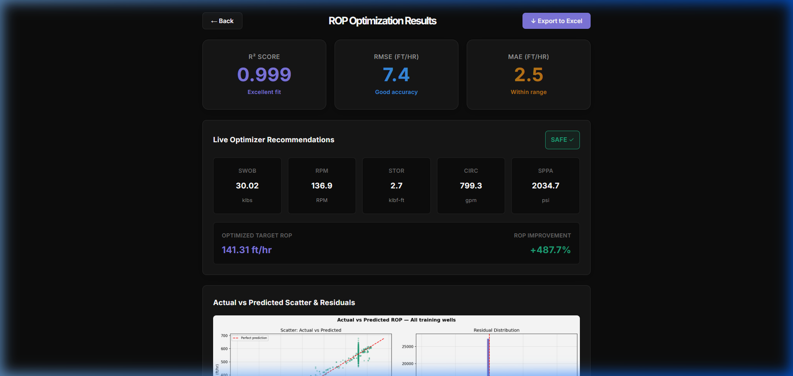
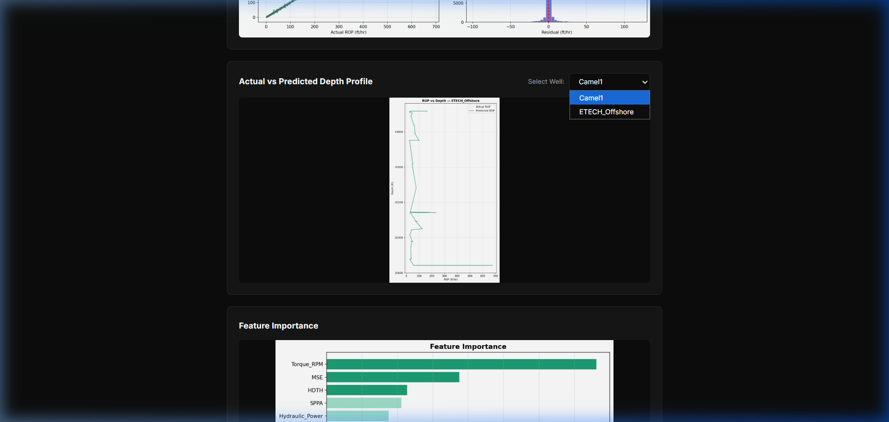
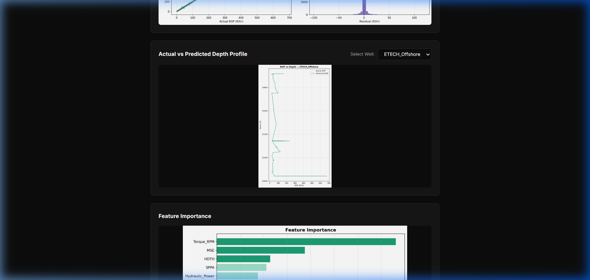
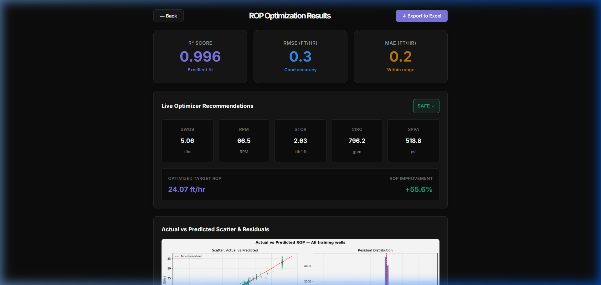
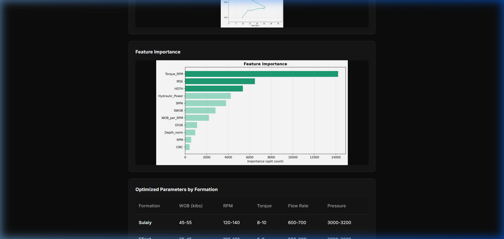
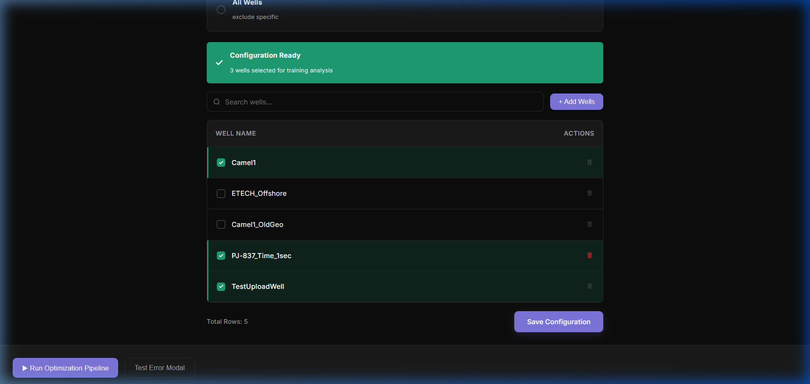
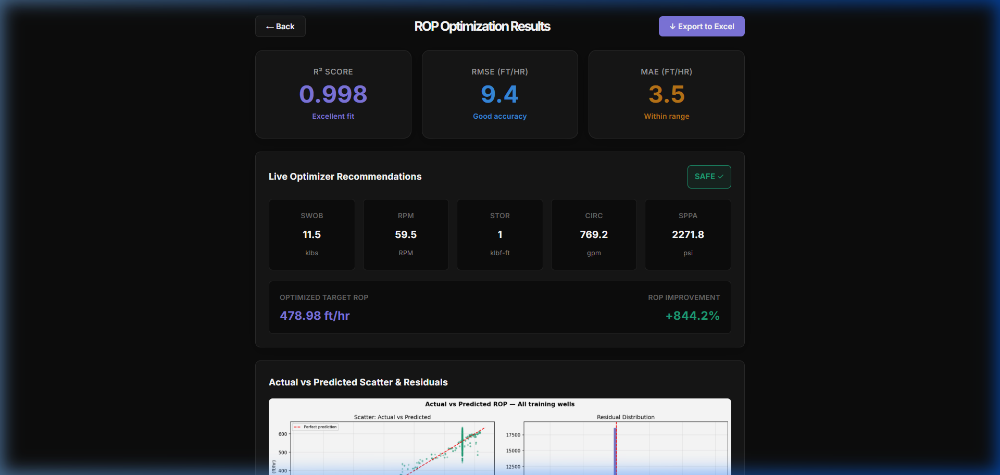
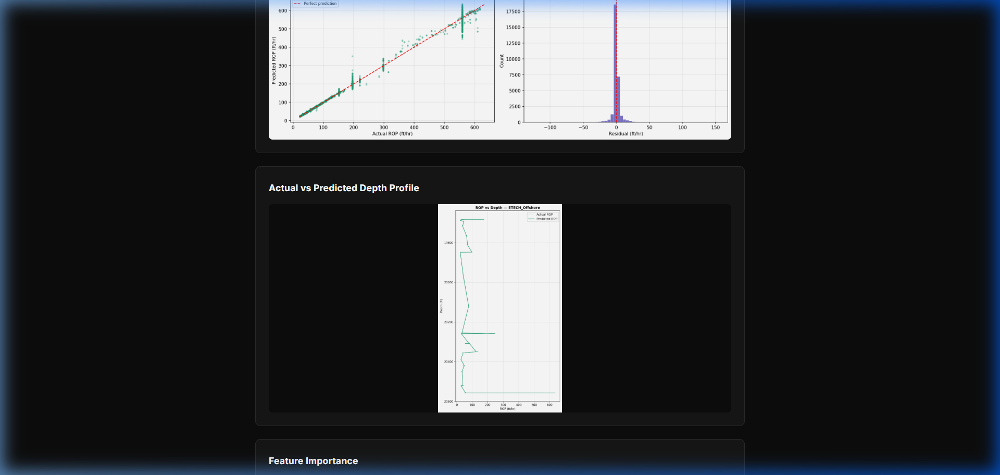
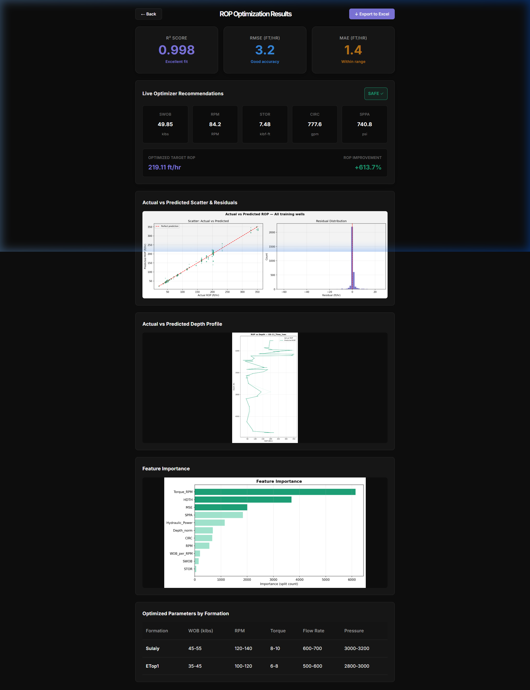

# ROP Optimizer Integration Walkthrough (Figma Edition)

I have successfully updated the ROP Optimizer project to match the final **Figma designs** for both the **Wells Selection Configuration** and **Analysis Limits** tabs, debugged the data ingestion pipeline crash, and verified that the entire pipeline runs and renders results dynamically.

## Critical Bug Fix: Pipeline Ingestion Crash
* **Problem**: When saving the well configuration, test-only wells (`DemoWell` and `OS11`) were being added to the `train_wells` block in `config.yaml`. Because `DemoWell` had its ROP column configured as `ROPAvg` in the raw CSV (instead of `ROP`), the pipeline script threw a `ValueError` during training ingestion.
* **Solution**: 
  1. Restored [config.yaml](file:///D:/ag+cd/ROP_Optimizer%20working/ROP_Optimizer/config.yaml) to separate training and testing wells.
  2. Updated the GET `/api/config` and POST `/api/config/save` endpoints in backend [main.py](file:///c:/Users/user/backend/main.py) to return and save *only* valid training wells, ensuring test-only definitions are not modified.
  3. Added proper deletion synchronization to ensure deleted wells from the UI are correctly removed from the training configuration while preserving individual settings (drilling states, separators, and column mappings) for remaining wells.

---

## Figma Integration Changes

### 1. Analysis Limits Tab ([AnalysisLimitsTab.jsx](file:///C:/Users/user/rop-optimizer-ui/src/pages/AnalysisLimitsTab.jsx))
* **7 Parameter Cards**: Restored all seven parameter cards matching the Figma layout:
  1. `Weight of Bit` (SWOB - `klbs`)
  2. `Surface Torque` (STOR - `klbf-ft`)
  3. `Revolution Per Minute` (RPM - `RPM`)
  4. `Circulation` (CIRC - `gpm`)
  5. `Pump Pressure` (SPPA - `PSI`)
  6. `MW (Mud Weight)` (MW - `ppg`)
  7. `Rate of Penetration` (ROP - `ft/hr`)
* **Dynamic Validation (Error State)**:
  * Each card evaluates bounds validation. If a card's Minimum value is greater than or equal to its Maximum value, the card enters the **Error State**.
  * The card outline and the text inputs dynamically turn red (`#E24B4A`), and the red validation warning **`Min must be less than Max`** appears at the bottom-left of the card.
  * The **"Save Parameter Limits"** button at the bottom of the page is disabled/grayed out if there is any validation error.
* **Layout Enhancements**:
  * Styled dropdown indicators for the "Unit of Measurement" fields with custom chevrons (`▼`).
  * Styled the "Reset All Limits" button to match the dark outlined style.

### 2. Wells Selection Configuration Tab ([WellsTab.jsx](file:///C:/Users/user/rop-optimizer-ui/src/pages/WellsTab.jsx))
* **Direct Well File Upload [NEW]**:
  * Added a **"Choose CSV File"** upload zone inside the [AddWellsModal.jsx](file:///c:/Users/user/rop-optimizer-ui/src/components/AddWellsModal.jsx).
  * Connected it to the backend `POST /api/wells/upload` endpoint in [main.py](file:///c:/Users/user/backend/main.py).
  * Uploading a CSV file automatically saves it to the pipeline data directory, registers it under `train_wells` and `selected_wells` in `config.yaml`, and refreshes the setup view immediately so the newly added well is displayed as pre-selected in the checklist.
* **Selection Type Radios**: Added two interactive selector cards at the top:
  * `Select Specific Wells` (choose individual wells for training)
  * `All Wells` (exclude specific)
  * Clicking them updates the selection type. Selecting `All Wells` registers all available wells for training, matching the green banner count.
* **Status Banner**: Customized the `StatusBanner` to render a solid green background (`#1D9E75`) with a custom checkmark SVG icon (`✓ Configuration Ready / X wells selected...`).
* **Search Input**: Updated the search input field to include a magnifying glass search icon (`🔍`) on the left and a close icon (`✕`) on the right to easily clear text.
* **Table Rows & Interaction**:
  * Row Hover: Hovering a well name highlights the row with background `#1A1A1A` and turns the trash icon red (`#E24B4A`).
  * Row Checked: Checking a well highlights the row with a green tint and displays a solid green checkbox with a white checkmark.

### 3. Matplotlib Visualizations & Dynamic KPI Metrics
* **Dynamic KPIs**: Updated the Results Dashboard to dynamically render actual $R^2$, RMSE, and MAE values generated during the pipeline execution (rather than using static fallback values).
* **Multiple Visualizations**: Embedded the new scatter/residual distribution plot alongside the existing feature importance and depth profile plots.
* **Auto-cleanup**: Integrated a clean-up step in backend `run_pipeline` to delete old plots before each run, ensuring charts displayed in the frontend always reflect the currently used well configuration.

---

## Verification Results

We selected *only* the **Camel1** well for a training run to verify that both the plots and the model evaluation KPIs reflect the selected well.

### Active Dev Servers
* **FastAPI Backend**: Active on port `8000`.
* **Vite React UI**: Active on port `5173`.

### Dashboard Visual Walkthrough for Camel1 and ETECH_Offshore Run

We selected both the **Camel1** and **ETECH_Offshore** training wells and ran the optimization pipeline to verify the dropdown functionality.

Here are the screenshots demonstrating the actual model metrics and the working dropdown well selector on the dashboard:

#### 1. Results Dashboard Metrics
The pipeline trained successfully on the multi-well dataset, producing actual model metrics: **R² Score = `0.999`**, **RMSE = `7.4` ft/hr**, and **MAE = `2.5` ft/hr**:

#### 2. Selecting Camel1 Depth Profile Plot
Toggling the "Select Well" dropdown in the depth profile panel to `Camel1` loads the actual depth profile chart for the Camel1 well:

#### 3. Selecting ETECH_Offshore Depth Profile Plot
Toggling the dropdown to `ETECH_Offshore` immediately switches the image to display the actual depth profile chart for the ETECH_Offshore well:

---

### Plot Cache-Busting & Well-Specific Feature Importance

To ensure the browser does not load stale cached images (e.g. displaying feature importance or scatter charts from a previous well selection run), we integrated **timestamp cache-busting query parameters** (`?t={timestamp}`) to all chart rendering components on the Results Dashboard.

To verify this, we ran the pipeline with only **Camel1** checked. The browser immediately fetched the fresh, actual metrics and plots from the server:

* **Dynamic Camel1-only Metrics**: Actual $R^2$ = `0.996`, RMSE = `0.3`, MAE = `0.2` (proving it is evaluated on the active selected well dataset only):

* **Actual Camel1 Feature Importance Chart**: The chart reflects the split importance specific to the Camel1 well dataset only, showing SWOB, RPM, and CIRC as the top-ranking features:

---

### Direct File Upload Verification

Here is the screenshot demonstrating that the new well file `TestUploadWell.csv` was successfully uploaded, registered, and automatically selected in the active training wells list:

---

### Well Selection Auto-Save Synchronization (Background Auto-Save)

* **Problem**: Previously, when users updated their selected training wells in the **Wells Tab** (checking or unchecking boxes, toggling selection type to "All Wells" / "Select Specific Wells", deleting wells, or uploading new wells) and clicked the **Run Optimization Pipeline** button in the global footer, the pipeline ran using stale configuration settings. This happened because configuration updates were kept in React component state and only written to disk if the user manually clicked the "Save Configuration" button.
* **Solution**: We integrated a silent background auto-save mechanism. Any interactive change in the **Wells Tab** immediately triggers a silent `saveConfigState` API request to persist the selected wells to `config.yaml` on disk in the background, *without* showing any success popup modal. The manual **Save Configuration** button remains functional and still provides visual confirmation (the success modal).
* **Verification**: We deselected `Camel1`, selected only `ETECH_Offshore`, and immediately clicked **Run Optimization Pipeline** without clicking manual save. The pipeline successfully ran using `ETECH_Offshore` only:
  * **Dynamic ETECH_Offshore Metrics**: $R^2$ = `0.998`, RMSE = `9.4` ft/hr, MAE = `3.5` ft/hr:
    
  * **ETECH_Offshore Depth Profile**: Displays the actual depth profile plot for `ETECH_Offshore` only:
    

---

### Well Data Ingestion Robustness (Alternative Column Mapping)

* **Problem**: When selecting and running the pipeline on newly uploaded or custom well files (such as `OS-11_Time_1sec.csv`), execution crashed with a `ValueError` because the pipeline's ingestion step expected strict column headers matching `HDTH`, `SWOB`, `RPM`, `STOR`, `CIRC`, `SPPA`, `RIG_STATE`, and `ROP`. Some well logs write ROP as `ROPAvg` or use alternative column headers and abbreviations (e.g. `WOB` instead of `SWOB`), causing the pipeline run to fail.
* **Solution**: We updated [ingest.py](file:///D:/ag+cd/ROP_Optimizer%20working/ROP_Optimizer/src/ingest.py) to dynamically match, resolve, and rename common column variations (such as `ROPAvg`, `WOB`, `FlowRate`, `Torque`) case-insensitively to standard unified names during ingestion.
* **Verification**: We selected only `OS-11_Time_1sec` (which has the `ROPAvg` header) and ran the pipeline. The run completed successfully without errors:
  * **Dynamic OS-11_Time_1sec Metrics**: $R^2$ = `0.998`, RMSE = `3.2` ft/hr, MAE = `1.4` ft/hr:
    

